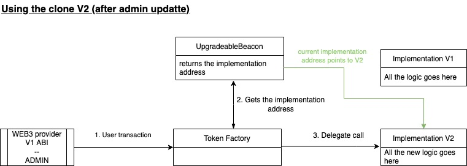

# Proof of Concept: Minimal upgradeable clones
This project uses the Beacon proxy pattern to deploy multiple minimal clones of one implementation contract in a upgradeable way.

There are single tests to confirm both implementations logic and `clones-test` to check and confirm that the upgreadability works properly. When a new implementation is upgraded on the beacon proxy, all the contracts previously created become proxies of the new implementation, having access to those new functions while preserving their previous state.

## Contracts
### TokenV1 
Simple and dummy version 1 implementation 

### TokenV2
Simple and dummy version 2 implementation. Changes the `version`function to check that, after upgrading the beacon implementation address, all the clones uses the new implementation.

### TokenFactory
Uses the BeaconProxy and UpgradeableBeacon to create multiple minimal contracts based on the current implementation address.
Offers the possibility to change the implementation address upgrading all previously created clones automatically to the new implementation address.

## Workflow
1. Admin account creates a token (clone) by calling `TokenFactory.createToken`

2. Any web3 user can call the token implementation through the Beacon Proxy

3. Admin account upgrades token implementation

4. previous and new tokens (clones) call the new implementation

## References
- [OpenZeppeling proxies documentation](https://docs.openzeppelin.com/contracts/3.x/api/proxy#beacon)
- [OpenZeppeling clones workshop](https://github.com/OpenZeppelin/workshops/tree/timelock-workshop/02-contracts-clone)
- [Basic tutorial for implementation inspiration](https://www.youtube.com/watch?v=2acgw589jRM)